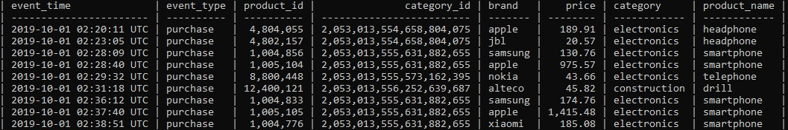

Data Cleaning In Linux Shell

This repository contained necessary script to turn raw data (data.zip) about traffic ecommerce into data_clean.csv which contain purchasing data only. This project done by using csvkit python external library for data wrangling in linux shell and some basic linux terminal built in command. For executing this repository in your machine you must have python virtual environment . And activate it using source bin/activate from your local terminal. 

Project Purpose
===

This project is to clean raw data from data.zip which contain two .csv file named “2019-Nov sample.csv” and “2019-Oct-sample.csv” which contain columns as follows :

 - `a`  : describe index number for every traffic ecommerce event
 - `event_time` : describe time-stamp of the event
 - `event_type` : describe the type of the event view and purchase, 
 - `product_id` : describe the product id being accessed
 - `category_id` : describe some category about the event
 - `category_code` : describe product category being accessed
 - `brand` : describe the company which made the product
 - `price` : describe the product price
 - `user_id` : describe the user id whom create the event
 - `user_session` : describe user session of that event

and make “data_clean.csv” from both csv file which contail column as follows :

 

|event_time|event_type|product_id|category|brand|price|category|product_name|
|:---:|:----:|:---:|:---:|:---:|:---:|:---:|:---:|
 

- `event_time` : will be contain time-stamp of the event purchase
- `event_type` : will be contain purchase all
- `product_id` : will be contain purchased product id
- `category_id` : will be contain category of purchased product
- `brand` : will be contain brand data of the purchased product
- `price` : will be contain price of the purchased product
- `category` : will be contain category of the purchased product
- `product_name` : will be contain name of the purchased product

 

Project Task
===

How To Use This Program
===

Suggestion
===

 

